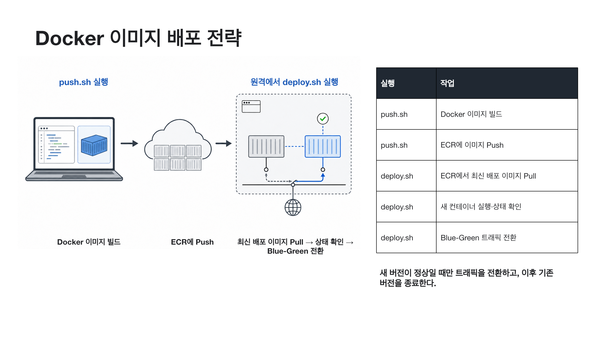

# Docker 이미지 배포 전략



## 전체 흐름

| 단계 | 실행 위치 | 작업 |
| --- | --- | --- |
| 1 | 개발 PC 또는 빌드 서버 | `push.sh`를 실행한다. |
| 2 | 개발 PC 또는 빌드 서버 | Docker 이미지를 빌드하고 Git 커밋 ID를 태그로 붙인다. |
| 3 | 개발 PC 또는 빌드 서버 | 이미지를 AWS ECR에 Push한다. |
| 4 | 원격 서버 | 같은 커밋 ID를 지정해 `deploy.sh`를 실행한다. |
| 5 | 원격 서버 | ECR에서 최신 배포 이미지를 Pull한다. |
| 6 | 원격 서버 | 현재 서비스 중인 컨테이너 반대편에 새 컨테이너를 실행한다. |
| 7 | 원격 서버 | 새 컨테이너가 정상인지 확인한다. |
| 8 | 원격 서버 | 정상인 경우에만 Nginx 트래픽을 새 컨테이너로 전환한다. |
| 9 | 원격 서버 | 전환이 끝나면 기존 컨테이너를 종료한다. |

## 스크립트 역할

- [`push.sh`](../scripts/push.sh): Docker 이미지 빌드와 ECR 업로드를 담당한다.
- [`deploy.sh`](../scripts/deploy.sh): 원격 서버의 이미지 다운로드와 Blue-Green 배포를 담당한다.

## 실행 전 준비

- 프로젝트 루트에 `Dockerfile`이 있어야 한다.
- 개발 PC에는 Docker와 AWS CLI가 필요하다.
- 원격 서버에는 Docker, AWS CLI, curl, Nginx가 필요하다.
- 원격 서버는 ECR 이미지를 내려받을 권한이 있어야 한다.
- 애플리케이션은 상태 확인 요청에 HTTP 200을 반환해야 한다.
- 애플리케이션 환경 파일과 AWS 인증 정보는 Git에 올리지 않는다.

## 이미지 업로드

```bash
AWS_ACCOUNT_ID=123456789012 \
ECR_REPOSITORY=etri-capstone \
AWS_REGION=ap-northeast-2 \
./scripts/push.sh
```

`push.sh`가 출력한 Git 커밋 태그를 기록한다.

## 원격 배포

```bash
AWS_ACCOUNT_ID=123456789012 \
ECR_REPOSITORY=etri-capstone \
APP_NAME=etri-capstone \
IMAGE_TAG=a1b2c3d \
CONTAINER_PORT=8000 \
HEALTH_PATH=/health \
./scripts/deploy.sh
```

`IMAGE_TAG`에는 `push.sh`가 출력한 값을 사용한다. `latest` 대신 특정 커밋 태그를 지정하면 어떤 소스에서 만든 이미지가 배포됐는지 추적할 수 있다.
